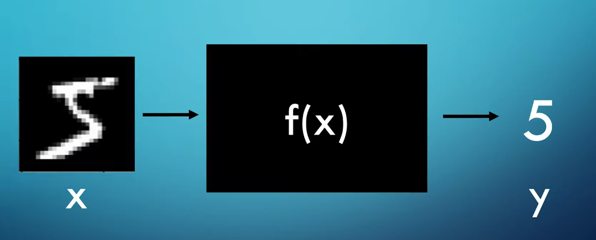

# Handwritten Digit Recognition using Neural Networks

Dieses Projekt konzentriert sich darauf, ein neuronales Netzwerk zu implementieren, um handgeschriebene Ziffern aus dem MNIST-Datensatz zu erkennen. Handgeschriebene Ziffernerkennung ist ein grundlegendes Problem im Bereich des maschinellen Lernens und wird oft als Ausgangspunkt für Studenten und Anfänger verwendet, aufgrund ihrer Zugänglichkeit und Relevanz.
Die Idee für das Projekt
 
## Über den MNIST-Datensatz
Der MNIST-Datensatz ist ein weit verbreiteter Benchmark-Datensatz in der maschinellen Lerngemeinschaft. Er besteht aus einer großen Sammlung von Graustufenbildern handgeschriebener Ziffern von 0 bis 9. Jedes Bild ist ein 28x28 Pixel großes Quadrat, was ihn zu einem relativ kleinen und überschaubaren Datensatz für Experimente macht.

## Problemstellung
Angesichts eines Eingangsbildes einer handgeschriebenen Ziffer besteht die Aufgabe darin, die Ziffer richtig zu identifizieren, die sie repräsentiert. Dieses Problem ist ein klassisches Beispiel für Bildklassifizierung, bei dem das Ziel darin besteht, jedem Eingangsbild ein Label (entsprechende Ziffer) zuzuweisen.

## Vorgehen
1. **Datenvorbereitung**: Der erste Schritt besteht darin, den MNIST-Datensatz herunterzuladen und vorzubereiten. Dies umfasst Aufgaben wie das Laden der Bilder, die Normalisierung der Pixelwerte und die Aufteilung des Datensatzes in Trainings- und Testsets.

2. **Neuronale Netzwerkarchitektur**: Das Design der Architektur des neuronalen Netzwerks ist entscheidend. In diesem Projekt werden wir verschiedene Architekturen wie Feedforward-Neuronale Netzwerke oder Convolutional Neural Networks (CNNs) experimentieren, um das geeignetste Modell für die Aufgabe zu finden.

3. **Training**: Sobald das neuronale Netzwerk definiert ist, muss es auf den Trainingsdaten trainiert werden. Während des Trainings lernt das Modell, Eingangsbilder ihren entsprechenden Ziffernlabels zuzuordnen, indem es seine internen Parameter durch Optimierungsalgorithmen wie Gradientenabstieg anpasst.

4. **Auswertung**: Nach dem Training wird die Leistung des Modells mithilfe des Testdatensatzes bewertet. Metriken wie Genauigkeit, Präzision, Rückruf und F1-Score werden häufig verwendet, um die Leistung des Modells zu bewerten.

5. **Bereitstellung**: Sobald das Modell zufriedenstellende Leistung zeigt, kann es für Anwendungen im wirklichen Leben bereitgestellt werden. Dies kann die Integration des Modells in Software-Systeme oder die Bereitstellung auf Cloud-Plattformen für Inferenz umfassen.

## Bedeutung
Obwohl das MNIST-Datensatzproblem auf den ersten Blick einfach erscheinen mag, hat es eine große Bedeutung im Bereich des maschinellen Lernens und der künstlichen Intelligenz. Seine Auswirkungen erstrecken sich über die Ziffernerkennung hinaus und dienen als Grundlage für komplexere Bildverarbeitungsaufgaben wie optische Zeichenerkennung (OCR) und die Digitalisierung handgeschriebener Dokumente.

## Fazit
Durch die Implementierung eines neuronalen Netzwerks zur Erkennung handgeschriebener Ziffern mithilfe des MNIST-Datensatzes bietet dieses Projekt nicht nur eine praktische Lernerfahrung im maschinellen Lernen, sondern unterstreicht auch die breitere Auswirkung solcher Technologien auf verschiedene Bereiche. Durch Experimente und Iterationen können Entwickler und Forscher weiterhin bestehende Modelle verbessern und Innovationen im Bereich der künstlichen Intelligenz vorantreiben.

 
 

 
